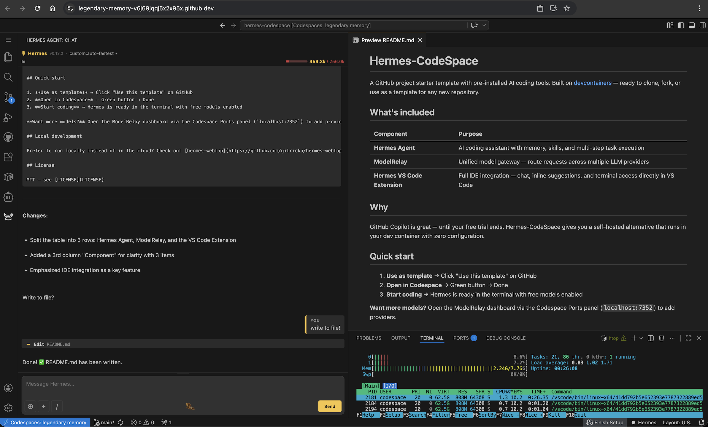

# Hermes-CodeSpace

A GitHub project starter template with pre-installed AI coding tools. Built on [devcontainers](https://containers.dev/) — ready to clone, fork, or use as a template for any new repository.

## What's included

| Component | Purpose |
|-----------|---------|
| **[Hermes Agent](https://github.com/nousresearch/hermes-agent)** | AI coding assistant with memory, skills, and multi-step task execution |
| **[ModelRelay](https://www.npmjs.com/package/modelrelay)** | OpenAI-compatible local router — benchmarks free coding models and routes requests to the best available provider |
| **[Hermes AI Agent — VS Code Extension](https://marketplace.visualstudio.com/items?itemName=joaompfp.hermes-ai-agent)** | Full IDE integration — chat, inline suggestions, and terminal access directly in VS Code |

## Why

GitHub Copilot is great — until your free trial ends. Hermes-CodeSpace gives you a self-hosted alternative that runs in your dev container with zero configuration.

## Quick start

1. **Fork the repo** → Click "Fork" on GitHub (or copy folder `.devcontainer` into your repo)
2. **Open in Codespace** → Green button → Done
3. **Start coding** → Hermes is ready in the terminal with free models enabled

**Want more models?** Open the ModelRelay dashboard via the Codespace Ports panel (`localhost:7352`) to add providers.

## Local development

Prefer to run locally instead of in the cloud? Check out [hermes-webtop](https://github.com/gitricko/hermes-webtop) for a Docker-based setup that runs on your own machine.

## License

MIT — see [LICENSE](LICENSE)
